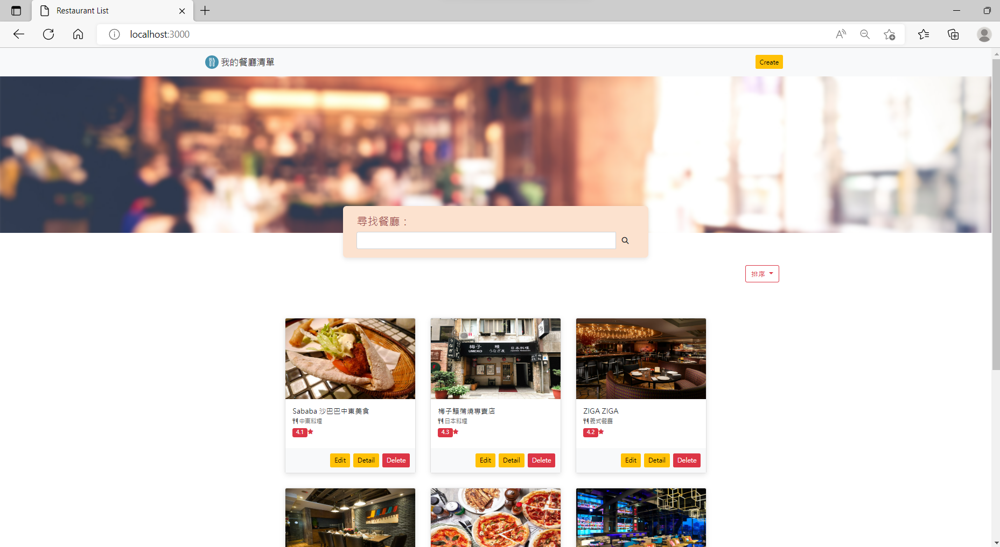

# 餐廳清單



## 介紹

給美食愛好者快速查找美食的網站

### 功能

- 查看所有的餐廳
- 搜尋欄搜尋餐廳
- 瀏覽餐廳詳細資訊
- 逐一新增餐廳資訊
- 逐一修改餐廳資訊
- 逐一刪除目標餐廳
- 排序所有的餐廳

## 開始使用

1. 請先確認有安裝 node.js 與 npm
2. 將專案 clone 到本地
3. 在本地開啟之後，透過終端機進入資料夾，輸入:

   ```bash
   cd restaurant_list
   ```

4. 進入資料夾後，輸入'npm run seed' 載入種子資料:

   ```bash
   npm run seed
   ```

5. 若看見'mongodb connected'表示伺服器連線成功。若看見'done'表示種子資料載入成功。
   輸入'ctrl + c'停止:
   
   ```bash
   mongodb connected!
   mongodb connected!
   done
   ```

4. 接著輸入'npm run start'執行渲染畫面:

   ```bash
   npm run start
   ```

5. 若看見"Express is listening on http://localhost:3000"
   則代表順利運行打開瀏覽器進入到以下網址:

   ```bash
   http://localhost:3000
   ```

6. 若欲暫停使用

   ```bash
   ctrl + c
   ```

## 開發工具

- Node.js 14.16.0
- Express 4.16.4
- Express-Handlebars 3.0.0
- Bootstrap 5.0.2
- Font-awesome 6.2.0
- body-parser 1.20.1
- method-override 3.0.0
- mongoose 5.0.7


